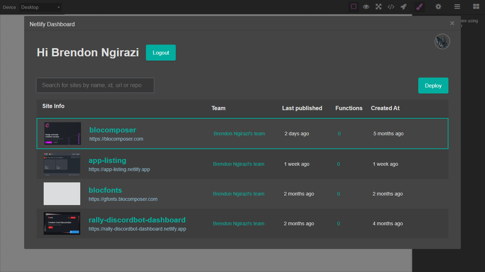

# Grapesjs Netlify

> This plugin implements a custom but similar [grapesjs-plugin-export](https://github.com/artf/grapesjs-plugin-export) so there is no need to install it.

Netlify dashboard for deploying sites directly in grapesjs



[DEMO](blocomposer.com/editor)

### HTML
```html
<link href="https://unpkg.com/grapesjs/dist/css/grapes.min.css" rel="stylesheet">
<link href="https://unpkg.com/grapesjs-netlify/dist/grapesjs-netlify.min.css" rel="stylesheet">
<script src="https://unpkg.com/grapesjs"></script>
<script src="https://unpkg.com/grapesjs-netlify"></script>

<div id="gjs"></div>
```

### JS
```js
const editor = grapesjs.init({
  container: '#gjs',
  height: '100%',
  fromElement: true,
  storageManager: false,
  plugins: ['grapesjs-netlify'],
});
```

### CSS
```css
body, html {
  margin: 0;
  height: 100%;
}
```


## Summary

* Plugin name: `grapesjs-netlify`
* Commands
    * `netlify-dashboard`
    * `gjs-export-zip`
* API
    * `editor.NetlifyDashboard`


## Options

| Option | Description | Default |
|-|-|-
| `token` | Personal netlify access token | ` ` |
| `mdlTitle` | Modal title | `Netlify Dashboard` |
| `authUrl` | Use this to authenticate instead of providing `token` | `/.netlify/functions/auth-start` |
| `loader` | Loader element | ` ` |
| `nodeploys` | No deploys element | ` ` |
| `onInvalidToken` | Invalid token durin auth | `check source` |
| `onDeploy` | On successful site deploy | `check source` |
| `onDeployErr` | On error site deploy | `check source` |
| `addExportBtn` | Add button inside the export dialog | `true` |
| `btnLabel` | Label for the export button | `Export to ZIP` |
| `filenamePfx` | ZIP filename prefix | `grapesjs_template` |
| `filename` | Use a function to generate the filename eg.`filename: ed => 'file.zip'` | `null` |
| `root` | Use the root object to create the folder structure of the your zip(async functions are supported) | `{...check source}` |


Using `async` in `root`:

```js
{
  css: {
    'style.css': ed => ed.getCss(),
    'file.txt': 'My custom content',
  },
  img: async ed => {
    const images = await fetchImagesByStructure(ed.getComponents());
    return images;
    // Where `images`:
    // { 'img1.png': '...png content', ... }
  }
  'index.html': ed => `<body>${ed.getHtml()}</body>`
}
```

* `authUrl` reference https://github.com/netlify-labs/oauth-example
* serverless function template https://github.com/Ju99ernaut/netlify-auth-serverless

## Download

* CDN
  * `https://unpkg.com/grapesjs-netlify`
* NPM
  * `npm i grapesjs-netlify`
* GIT
  * `git clone https://github.com/Ju99ernaut/grapesjs-netlify.git`


## Usage

Directly in the browser
```html
<link href="https://unpkg.com/grapesjs/dist/css/grapes.min.css" rel="stylesheet"/>
<link href="https://unpkg.com/grapesjs-netlify/dist/grapesjs-netlify.min.css" rel="stylesheet">
<script src="https://unpkg.com/grapesjs"></script>
<script src="path/to/grapesjs-netlify.min.js"></script>

<div id="gjs"></div>

<script type="text/javascript">
  var editor = grapesjs.init({
      container: '#gjs',
      // ...
      plugins: ['grapesjs-netlify'],
      pluginsOpts: {
        'grapesjs-netlify': { /* options */ }
      }
  });
</script>
```

Modern javascript
```js
import grapesjs from 'grapesjs';
import plugin from 'grapesjs-netlify';
import 'grapesjs/dist/css/grapes.min.css';
import 'grapesjs-netlify/dist/grapesjs-netlify.min.css'

const editor = grapesjs.init({
  container : '#gjs',
  // ...
  plugins: [plugin],
  pluginsOpts: {
    [plugin]: { /* options */ }
  }
  // or
  plugins: [
    editor => plugin(editor, { /* options */ }),
  ],
});
```


## Development

Clone the repository

```sh
$ git clone https://github.com/Ju99ernaut/grapesjs-netlify.git
$ cd grapesjs-netlify
```

Install dependencies

```sh
$ npm i
```

Build sass

```sh
$ npm run build:css
```

Start the dev server

```sh
$ npm start
```

Build the source

```sh
$ npm run build
```

## To Do

If you're interested in contributing to the project these could be good starting points

- [x] Multi-page deploys(Already possible)
- [ ] Serverless functions(See `functions` branch)
- [x] Forms([grapesjs-plugin-forms](https://github.com/artf/grapesjs-plugin-forms) can be made compatible)
- [ ] More settings(Domain management)

### Forms

```js
//make forms netlify compatible
const domc = editor.Components;
const typeForm = domc.getType('form').model;
domc.addType('form', {
    model: {
        initTraits() {
            typeForm.prototype.initTraits.apply(this, arguments);
            const tr = this.get('traits');
            tr.push({
                type: 'checkbox',
                name: 'data-netlify',
                label: 'Netlify'
            });
            this.set('traits', tr);
        }
    }
});
```

## License

MIT
